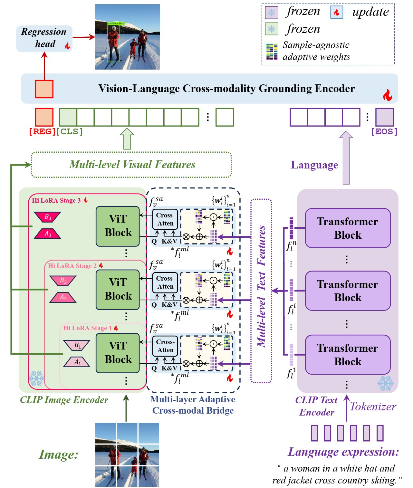
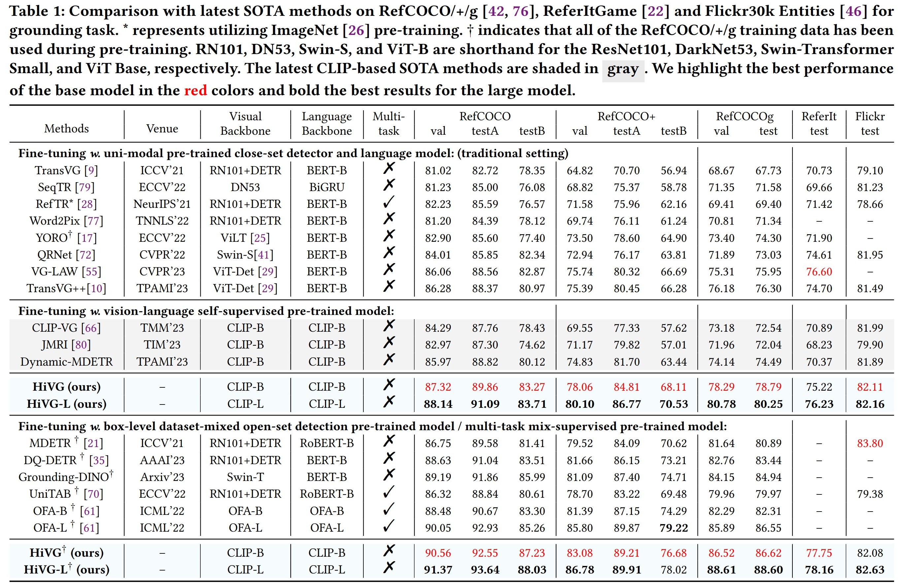
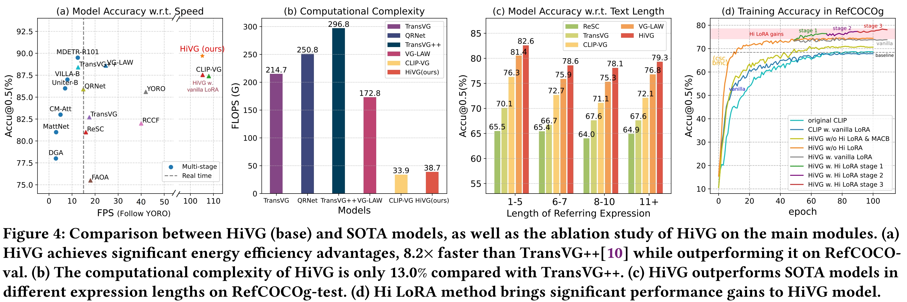
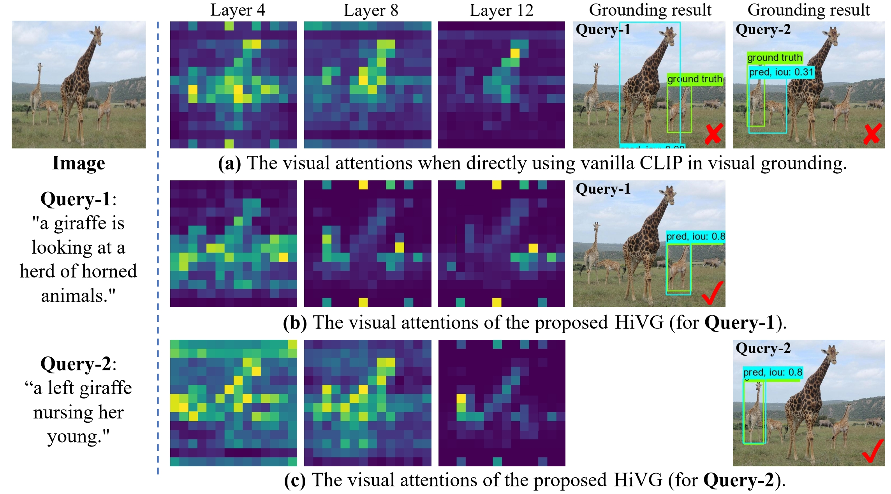
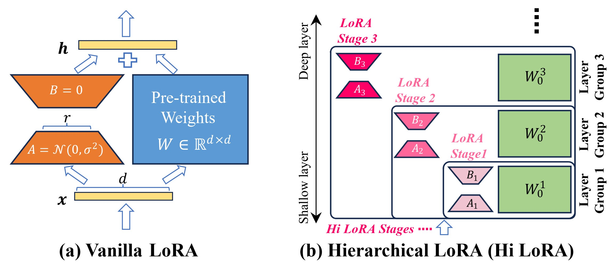
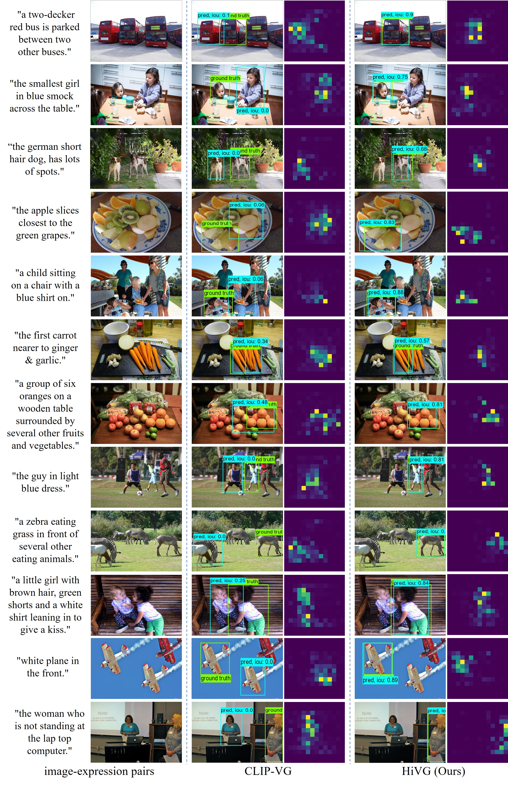

[//]: # (<br />)
<p align="center"> <h1 align="center">HiVG: Hierarchical Multimodal Fine-grained Modulation for Visual Grounding</h1>
  <p align="center">
    <b> ACM MM, 2024 </b>
    <br />
    <a href="https://scholar.google.com.hk/citations?user=4rTE4ogAAAAJ&hl=zh-CN&oi=sra"><strong> Linhui Xiao </strong></a>
    ·
    <a href="https://yangxs.ac.cn/home"><strong>Xiaoshan Yang </strong></a>
    ·
    <a href="https://scholar.google.com.hk/citations?user=HBZ9plsAAAAJ&hl=zh-CN"><strong>Fang Peng </strong></a>
    ·
    <a href="https://scholar.google.com.hk/citations?user=o_DllmIAAAAJ&hl=zh-CN"><strong>Yaowei Wang </strong></a>
    ·
    <a href="https://scholar.google.com.hk/citations?user=hI9NRDkAAAAJ&hl=zh-CN"><strong>Changsheng Xu</strong></a>
  </p>

  <p align="center">
    <a href='https://arxiv.org/pdf/2404.13400'>
      
    </a>
    <a href='https://openreview.net/forum?id=NMMyGy1kKZ'>
      
    </a>
    <a href='docs/ACM_MM_2024_HiVG_poster.pdf'>
      
    </a>
<br />


<p align="center">  </p>


This repository is the official Pytorch implementation for the paper [**HiVG: Hierarchical Multimodal Fine-grained 
Modulation for Visual Grounding**](https://arxiv.org/abs/2404.13400), which is an advanced version
of our preliminary work **CLIP-VG** ([github](https://github.com/linhuixiao/CLIP-VG), [publication](
https://ieeexplore.ieee.org/abstract/document/10269126), [Arxiv](https://arxiv.org/abs/2305.08685)). 

If you have any questions, please feel free to open an issue or contact me with emails: <xiaolinhui16@mails.ucas.ac.cn>.
Any kind discussions are welcomed!


<h3 align="left">
Links: 
<a href="https://arxiv.org/pdf/2404.13400">ArXiv</a>, 
<a href="https://openreview.net/forum?id=NMMyGy1kKZ">ACM MM 2024</a>
</h3>

**Please leave a <font color='orange'>STAR ⭐</font> if you like this project!**

## News

- :fire: **Update on 2025/01/30: The full code and models of HiVG have been released!**
- :fire: **Update on 2024/12/28: We conducted a survey of Visual Grounding over the past decade, entitled "Towards Visual Grounding: A Survey" ([Paper](https://arxiv.org/pdf/2412.20206), [Project](https://github.com/linhuixiao/Awesome-Visual-Grounding)), Comments are welcome !!!**
- :fire: **Update on 2024/10/10: Our new grounding work **OneRef** ([Paper](https://arxiv.org/abs/2410.08021), [Code](https://github.com/linhuixiao/OneRef)) has been accepted by the top conference NeurIPS 2024 !**
- :fire: **Update on 2024/07/16: Our grounding work HiVG ([Paper](https://openreview.net/pdf?id=NMMyGy1kKZ), [Code](https://github.com/linhuixiao/HiVG)) has been accepted by the top conference ACM MM 2024 !**
- **Update on 2024/04/20: Release the HiVG project repository.**
- **Update on 2023/9/25: Our preliminary work CLIP-VG ([Paper](https://ieeexplore.ieee.org/abstract/document/10269126), [Code](https://github.com/linhuixiao/CLIP-VG)) has been accepted by the top journal IEEE Transaction on Multimedia (2023)!**

## Citation

If you find our work helpful for your research, please consider citing the following BibTeX entry.   

```bibtex
@inproceedings{xiao2024hivg,
      title={HiVG: Hierarchical Multimodal Fine-grained Modulation for Visual Grounding},
      author={Linhui Xiao and Xiaoshan Yang and Fang Peng and Yaowei Wang and Changsheng Xu},
      booktitle={ACM Multimedia 2024},
      year={2024},
      url={https://openreview.net/forum?id=NMMyGy1kKZ}
}
```

## Contents

1. [Introduction](#introduction)
2. [Usage](#usage)
3. [Results](#results)
4. [Contacts](#contacts)
5. [Acknowledgments](#acknowledgments)


## Highlight
-  **A concise hierarchical multimodal modulation framework**, which utilizes the hierarchical structure to gradually adapt CLIP to grounding. HiVG achieves fine-grained interaction between multi-level visual representations and language semantics, and significantly alleviates the task gap between CLIP and grounding.
- **The first to propose the hierarchical multimodal low-rank adaptation paradigm.** Hi LoRA is a basic and concise hierarchical adaptation paradigm, which is task-agnostic.
- **Extensive experiments are conducted to verify the effectiveness of HiVG approaches.** Results show that our method achieves promising results, surpassing the SOTA methods under the same setting by a significant margin. Besides, our model offers significant computing efficiency advantages.


## TODO
- [x] Release all the checkpoints.
- [x] Release the full model code, training and inference code.


## Introduction

Visual grounding, which aims to ground a visual region via natural language, is a task that heavily relies on cross-modal 
alignment. Existing works utilized uni-modal pre-trained models to transfer visual/linguistic knowledge separately while 
ignoring the multimodal corresponding information. Motivated by recent advancements in contrastive language-image 
pre-training and low-rank adaptation (LoRA) methods, we aim to solve the grounding task based on multimodal pre-training.
However, there exists significant task gaps between pre-training and grounding. Therefore, to address these gaps, we 
propose **a concise and efficient hierarchical multimodal fine-grained modulation framework**, namely **HiVG**. Specifically,
HiVG consists of a multi-layer adaptive cross-modal bridge and a hierarchical multimodal low-rank adaptation (Hi LoRA) 
paradigm. The cross-modal bridge can address the inconsistency between visual features and those required for grounding,
and establish a connection between multi-level visual and text features. Hi LoRA prevents the accumulation of perceptual 
errors by adapting the cross-modal features from shallow to deep layers in a hierarchical manner. Experimental results 
on five datasets demonstrate the effectiveness of our approach and showcase the significant grounding capabilities as well 
as promising energy efficiency advantages.

For more details, please refer to [our paper](https://arxiv.org/abs/2404.13400).

## Usage
### Dependencies
- Python 3.9.10
- Pytorch 2.2.2
- transformers==4.30.0
- Check [requirements.txt](requirements.txt) for other dependencies. 
- It is recommended that the code be run under Anaconda env. If a library is missing while the code is running, 
  you can simply install it using `pip install <library_name>` or `conda install <library_name>`.

Our model is **easy to deploy** in a variety of environments and **has been successfully tested** on multiple pytorch versions.


### Image Data Preparation
1.You can download the images from the original source and place them in your disk folder, such as `$/path_to_image_data`:
- [MS COCO 2014](download_mscoco2014.sh) (for RefCOCO, RefCOCO+, RefCOCOg dataset, almost 13.0GB) 
- [ReferItGame](https://drive.google.com/drive/folders/1D4shieeoKly6FswpdjSpaOrxJQNKTyTv)
- [Flickr30K Entities](http://shannon.cs.illinois.edu/DenotationGraph/#:~:text=make%20face-,Downloads,-Please%20fill%20in)

   We provide a script to download the mscoco2014 dataset, you just need to run the script in terminal with the following command:
   ```
   bash download_mscoco2014.sh
   ```
   Or you can also follow the data preparation of TransVG, which can be found in [GETTING_STARTED.md](https://github.com/djiajunustc/TransVG/blob/main/docs/GETTING_STARTED.md).

Only the image data in these datasets is used, and these image data is easily find in similar repositories of visual grounding work, such as [TransVG](https://github.com/linhuixiao/TransVG) etc. 
Finally, the `$/path_to_image_data` folder will have the following structure:  

```angular2html
|-- image_data
   |-- Flickr30k
      |-- flickr30k-images
   |-- other
      |-- images
        |-- mscoco
            |-- images
                |-- train2014
   |-- referit
      |-- images
```
- ```$/path_to_image_data/image_data/Flickr30k/flickr30k-images/```: Image data for the Flickr30K dataset, please download from this [link](http://shannon.cs.illinois.edu/DenotationGraph/#:~:text=make%20face-,Downloads,-Please%20fill%20in). Fill the form and download the images.
- ```$/path_to_image_data/image_data/other/images/```: Image data for RefCOCO/RefCOCO+/RefCOCOg, i.e., mscoco2014. 
- ```$/path_to_image_data/image_data/referit/images/```: Image data for ReferItGame.

## Text-Box Anotations 
The labels are consistent with previous works such as [TransVG](https://github.com/linhuixiao/TransVG). **However, 
this paper employs contrastive learning and shuffles the training examples; therefore, 
you will need to re-download the data from us. Additionally, we also provide the `mixup` dataset for mixup grounding training, 
which comprises by the five training sets (i.e., RefCOCO/+/g, ReferIt, Flickr30k). Note that the RefCOCOg-g (i.e., gref) 
training set is excluded in the `mixup` because it exists test set data leakage. The val and test split in `mixup` are 
copied from the RefCOCOg dataset.**


### text-box anotations download
<table>
    <tr> <!-- line 3 -->
    <th style="text-align:center" > Datasets </th>
    <th style="text-align:center" > RefCOCO </th>
    <th style="text-align:center" > RefCOCO+ </th>
    <th style="text-align:center" > RefCOCOg-u </th>
    <th style="text-align:center" > ReferIt </th>
    <th style="text-align:center" > Flickr </th>
    <th style="text-align:center" > Mixup pretraining </th>
    </tr>
    <tr> <!-- line 2 -->
        <th style="text-align:center" rowspan="1"> url, size </th> <!-- table head -->
        <th style="text-align:center" colspan="6"> <a href="https://drive.google.com/file/d/1oaKlHeEECr-KFSDcWUG3X0UNUhqjGugr/view?usp=drive_link">ref_data_shuffled</a>,  267.0MB </th>  <!-- table head -->
    </tr>
</table>

Download the above annotations to a disk directory such as `$/path_to_split/ref_data_shuffled`; then will have the following similar directory structure:

```angular2html
|-- /ref_data_shuffled
    ├── flickr
    │   ├── flickr_test.pth
    │   ├── flickr_train.pth
    │   └── flickr_val.pth
    ├── gref_umd
    │   ├── gref_umd_test.pth
    │   ├── gref_umd_train.pth
    │   └── gref_umd_val.pth
    ├── referit
    │   ├── referit_test.pth
    │   ├── referit_train.pth
    │   └── referit_val.pth
    ├── unc
    │   ├── unc_testA.pth
    │   ├── unc_testB.pth
    │   ├── unc_train.pth
    │   └── unc_val.pth
    ├── unc+
    │   ├── unc+_testA.pth
    │   ├── unc+_testB.pth
    │   ├── unc+_train.pth
    │   └── unc+_val.pth
    └── mixup
        ├── mixup_test.pth
        ├── mixup_train.pth
        └── mixup_val.pth
```


## Pre-trained Checkpoints

The checkpoints include the Base model and Large mode under the single-dataset fine-tuning setting and dataset-mixed 
grounding pretraining setting. 

### Single-dataset fine-tuning checkpoints download

<table>
    <tr> <!-- line 3 -->
    <th style="text-align:center" > Datasets </th>
    <th style="text-align:center" > RefCOCO </th>
    <th style="text-align:center" > RefCOCO+ </th>
    <th style="text-align:center" > RefCOCOg-u </th>
    <th style="text-align:center" > ReferIt </th>
    <th style="text-align:center" > Flickr </th>
    </tr>
    <tr> <!-- line 2 -->
        <th style="text-align:center" rowspan="1"> base model </th> <!-- table head -->
        <th style="text-align:center" colspan="6"> <a href="https://drive.google.com/file/d/1vM_568M7DwnYmjEiJgXRnrDL5UT65CGJ/view?usp=drive_link"> finetuning_base (for all), ~4.0 GB </a>  </th>  <!-- table head -->
    </tr>
    <tr> <!-- line 2 -->
        <th style="text-align:center" rowspan="1"> base model </th> <!-- table head -->
        <th style="text-align:center" colspan="6"> <a href="https://drive.google.com/file/d/1Yw_AVaYnw4amPsemFwKFurXgaKvJ11CB/view?usp=drive_link">finetuning_large (for all), ~8.0 GB </a>  </th>  <!-- table head -->
    </tr>
</table>


### Mixup grounding pre-training checkpoints download

<table>
    <tr> <!-- line 3 -->
    <th style="text-align:center" > Datasets </th>
    <th style="text-align:center" > Mixup </th>
    </tr>
    <tr> <!-- line 2 -->
        <th style="text-align:center" rowspan="1"> base model </th> <!-- table head -->
        <th style="text-align:center" colspan="1"> <a href="https://drive.google.com/file/d/1TzDLWjS-lXEr2M9uwaSBlU0MRmaRLSmN/view?usp=sharing">mixup_pretraining_base, ~1.0 GB </a>  </th>  <!-- table head -->
    </tr>
    <tr> <!-- line 3 -->
    <th style="text-align:center" > Large model </th>
    <th style="text-align:center" > <a href="https://drive.google.com/file/d/1H_tv9QcDK712Ie9flLgSCZmmj0HEcjb8/view?usp=drive_link">mixup_pretraining_large, ~2.0 GB</a> </th>
    </tr>
</table>


After downloading all of these checkpoints, you can save them in the following directory, allowing you to train and test 
the five datasets at once and just using a single script.

```angular2html
|-- /finetuning_checkpoints (base or large model)
    ├── flickr
    │   └── best_checkpoint.pth
    ├── gref_umd
    │   └── best_checkpoint.pth
    ├── referit
    │   └── best_checkpoint.pth
    ├── unc
    │   └── best_checkpoint.pth
    └── unc+
        └── best_checkpoint.pth

|-- /mixup_grounding_pretraining (base or large model)
    └── mixup
        └── best_checkpoint.pth
```


### CLIP domain generalized checkpoints download

Due to the domain bias of CLIP on the MSCOCO dataset, we follow previous work, such as TransVG++, VG-LAW, etc., to conduct 
pre-training for the backbone network on the MSCOCO dataset while excluding RefCOCO/+/g related images. 
For this pre-training, the [Detectron2](https://github.com/facebookresearch/detectron2) framework is used for detection and segmentation training under the vanilla LoRA paradigm. 
If you want to training HiVG, please download the fine-tuned CLIP model using LoRA on MSCOCO dataset from the link below.


<table>
    <tr> <!-- line 3 -->
    <th style="text-align:center" > Model </th>
    <th style="text-align:center" > Debiased CLIP model using LoRA on the MSCOCO dataset </th>
    </tr>
    <tr> <!-- line 2 -->
        <th style="text-align:center" rowspan="1"> base model (ViT-B/224) </th> <!-- table head -->
        <th style="text-align:center" colspan="1"> <a href="https://drive.google.com/file/d/1pgso4gjHselrj4ExqJP3PYRbbX754aRq/view?usp=sharing">clip_b_ml_cascade_maskrcnn_model_224, 580 MB </a>  </th>  <!-- table head -->
    </tr>
    <tr> <!-- line 3 -->
    <th style="text-align:center" > Large model (ViT-L/224) </th>
    <th style="text-align:center" > <a href="https://drive.google.com/file/d/18T4g6P-duKifx5Ksw6gHmL0ttKW39Wa6/view?usp=sharing">clip_l_ml_cascade_maskrcnn_model_224, 1.6 GB</a> </th>
    </tr>
</table>

Alternatively, you can also use the original CLIP Hugging Face model for training, for which we provide a download link.
In this case, the performance may be degraded.

<table>
    <tr> <!-- line 3 -->
    <th style="text-align:center" > Model </th>
    <th style="text-align:center" > original CLIP Hugging Face model </th>
    </tr>
    <tr> <!-- line 2 -->
        <th style="text-align:center" rowspan="1"> base model (ViT-B/224) </th> <!-- table head -->
        <th style="text-align:center" colspan="1"> <a href="https://drive.google.com/file/d/1SgWSK6vOKgPpEaULlHGZBnxotZ241phG/view?usp=drive_link">clip-vit-base-patch16, 375 MB </a>  </th>  <!-- table head -->
    </tr>
    <tr> <!-- line 3 -->
    <th style="text-align:center" > Large model (ViT-L/224) </th>
    <th style="text-align:center" > <a href="https://huggingface.co/openai/clip-vit-large-patch14/tree/main">clip-vit-large-patch14, 1.6 GB</a> </th>
    </tr>
</table>


## Training and Evaluation


### Evaluation


1. Download the images and text annotations for the five datasets, as well as the trained HiVG model and CLIP initialization model. 
   You need to change the ```$/path_to_clip``` in [models/HiVG.py](models/HiVG.py) to your own CLIP model directory.

2. The evaluation script are as follows:
    ```angular2html
    |-- /train_and_eval_script
        ├── eval_single_dataset_finetuning_base.sh
        ├── eval_single_dataset_finetuning_large.sh
        ├── eval_mixup_grounding_pretraining_base.sh
        └── eval_mixup_grounding_pretraining_large.sh
    ```

3. You just need to change ```$/path_to_split```, ``` $/path_to_image_data```, ``` $/path_to_output``` to your own file directory to execute the above command.
   We strongly recommend to use the following commands to training or testing with different datasets and splits, which will significant reduce the training workforce. Such as:
    ```
    bash train_and_eval_script/eval_single_dataset_finetuning_base.sh
    ```

4. For a specific dataset, the instruction is just like follows:
    ```
    CUDA_VISIBLE_DEVICES=1,2,3,4,5,6,7 python -m torch.distributed.launch --nproc_per_node=7 --master_port 28888 --use_env hivg_eval.py --num_workers 2 --batch_size 60  --dataset unc           --vl_hidden_dim 512 --imsize 224 --max_query_len 77 --normalize_before --enable_adaptive_weights --use_mask_loss  --save_hilora_clip --hi_lora_stage 3 --data_root /path_to_image_data --split_root /path_to_split/ref_data_shuffled --eval_model /patch_to_output/finetuning_base/unc/best_checkpoint.pth      --eval_set testA  --output_dir /patch_to_output/finetuning_base/unc;
    ```
    Please refer to the files in [train_and_eval_script](train_and_eval_script) for evaluation commands on other splits or datasets under different settings.


### Training

1. Download the images and text annotations for the five datasets, as well as the trained HiVG model and CLIP initialization model. 
   You need to change the ```$/path_to_clip``` in [models/HiVG.py](models/HiVG.py) to your own CLIP model directory.

2. The evaluation script are as follows:
    ```angular2html
    |-- /train_and_eval_script
        ├── train_single_dataset_finetuning_base.sh
        ├── train_single_dataset_finetuning_large.sh
        ├── train_mixup_grounding_pretraining_base.sh
        └── train_mixup_grounding_pretraining_large.sh
    ```

3. You just need to change ```$/path_to_split```, ``` $/path_to_image_data```, ``` $/path_to_output``` to your own file directory to execute the above command.
   We strongly recommend to use the following commands to training or testing with different datasets and splits, which will significant reduce the training workforce. Such as:
    ```
    bash train_and_eval_script/train_single_dataset_finetuning_base.sh
    ```

4. **For a specific dataset, if you want to enable HiLoRA, your training may involve 4 stages: the warmup stage, 
   HiLoRA stage 1, HiLoRA stage 2, and HiLoRA stage 3.**

   **Note that the essence of the HiLoRA mechanism is a process of decomposing parameter learning, and its effectiveness
   is influenced by the learning rate and the number of epochs. Therefore, HiLoRA requires different learning rates and numbers of epochs at various stages for specific model 
   configurations. If you do not need to enable HiLoRA, simply leave `args.hi_lora_stage=0` as the default.** 

5. **The Large version of the model is somewhat difficult to train and empirically requires one or two stages of warmup.** 
   In the first stage, `arg.warmup` needs to be enabled, and the visual adapt layer must be forced to be empty `[]` 
   to train the cross-modal fusion encoder, which is equivalent to freezing the CLIP model. 
   Only 5-10 epochs are needed for this phase. In the second stage, `arg.warmup` is turned off, and normal training 
   is performed; at this time, linguistic information can fine-tune the visual features through the cross-modal bridge.

   Please refer to the files in [train_and_eval_script](train_and_eval_script) for training commands on other splits or datasets under different settings.


## Results

### 1. RefCOCO, RefCOCO+, RefCOCOg, ReferIt, Flickr, datasets
<details open>
<summary><font size="4">
SOTA Result Table
</font></summary>

</details>

**(1) When compared to the CLIP-based fine-tuning SOTA work**, i.e., Dynamic-MDETR, our approach consistently 
outperforms it by achieving an increase of 3.15%(testB), 3.11%(testA), 4.30%(test), 5.55%(test), 
0.22%(test) on all five datasets. 

**(2) When compared to the detector-based fine-tuning SOTA work**, i.e., 
TransVG++, our approach demonstrates superior performance (improved by 2.30%(testB), 4.36%(testA), 2.49%(test), 
1.22%(test), 0.62%(test)) across all five datasets. The improvement of our results on the RefCOCO+/g datasets is 
considerably more significant, indicating our model exhibits a stronger capacity for semantic comprehension in complex 
sentences. 

**(3) When compared with the dataset-mixed pre-training works**, the base model of our work outperforms 
Grounding-DINO by 1.24%(testB), 1.81%(testA), and 1.68%(testA) on the RefCOCO/+/g 
datasets, and it also outperforms OFA by 3.93%(testB), 2.06%(testA), and 4.31%(testA). 
After dataset-mixed pre-training, our performance has significantly improved, further demonstrating the effectiveness 
of our method.

### 2. Our model also has significant energy efficiency advantages.

<details open>
<summary><font size="4">
Illustration
</font></summary>
<div align=center>
</div>
</details>

**Comparison between HiVG (base) and SOTA models, as well as the ablation study of HiVG on the main modules.** (a) HiVG 
achieves significant energy efficiency advantages, **8.2x** faster than TransVG++ while
outperforming it on RefCOCO-val. (b) The computational complexity of HiVG is **only 13.0%** compared with 
TransVG++. (c) HiVG outperforms SOTA models in different expression lengths on RefCOCOg-test. (d) Hi LoRA method brings
significant performance gains to HiVG model.


## Methods 

<p align="center">  </p>

**Visual attentions and grounding results of CLIP and the proposed HiVG.** The attentions are perceived by the 
[CLS] token over vision tokens.

<p align="center">  </p>

**Hi LoRA and vanilla LoRA.** (a) The vanilla LoRA learns the global low-rank matrix utilizing the entire set of 
pre-trained weights in a single round. (b) The proposed Hi LoRA employs a hierarchical approach to adapt the pre-trained 
model in a progressive manner, thereby finely reducing the task gap between pre-training and transfer tasks.

## Visualization
<p align="center">  </p>

 **Qualitative results of our HiVG framework on the RefCOCOg-val split.** The CLIP-VG model is compared. We present the
 prediction box with IoU (in cyan) and the ground truth box (in green) in a unified  image to visually display the 
 grounding accuracy. We show the [REG] token’s attention over vision tokens from the last 
 grounding block of each framework. The examples exhibit the relatively more challenging instances for grounding, thereby 
 showcasing HiVG's robust semantic comprehension capabilities.

## Contacts
Email: <xiaolinhui16@mails.ucas.ac.cn>.
Any kind discussions are welcomed!

## Acknowledgement

Our model is related to [CLIP](https://github.com/openai/CLIP), [CLIP-VG](https://github.com/linhuixiao/CLIP-VG). Thanks for their great work!

We also thank the great previous work including [TransVG++](https://github.com/linhuixiao/TransVG), 
[DETR](https://github.com/facebookresearch/detr), [QRNet](https://github.com/LukeForeverYoung/QRNet), etc. 

Thanks [OpenAI](https://github.com/openai) for their awesome models.


## Star History

[](https://star-history.com/#linhuixiao/HiVG&Date)


